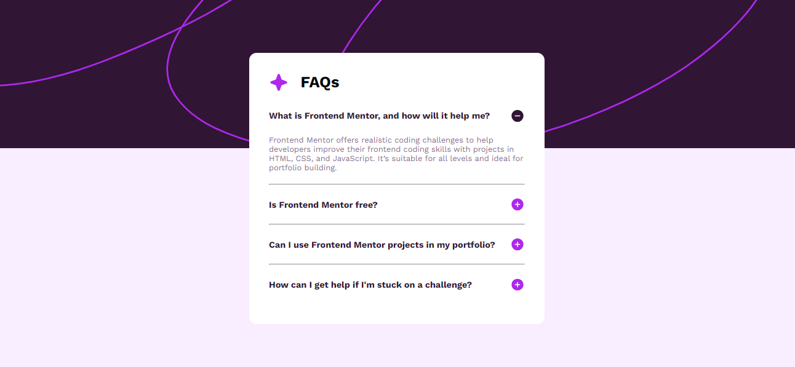

# Title
    FAQ Accordion 

# Preview of the App

# Description
    FrontendMentor Challenge

# Stack used :
    HTML/CSS/JS

## General style :

### BreakPoints :

1. Mobile   :700px;

### Fonts :

- Family: [Work Sans](https://fonts.google.com/specimen/Work+Sans)

### Colors :

- White: hsl(0, 0%, 100%)
- Light pink: hsl(275, 100%, 97%)
- Grayish purple: hsl(292, 16%, 49%)
- Dark purple: hsl(292, 42%, 14%)

***
***
***
#### Contact info :

##### oussama Amdouni FrontEnd web-developer

[Portfolio]() | [Linkedin](https://www.linkedin.com/in/usama-amdouni/) | [Github](https://github.com/hernon07) | [Frontend Mentor](https://www.frontendmentor.io/profile/hernon07) | [LeetCode](https://leetcode.com/u/hernon07/)
***
***
***
